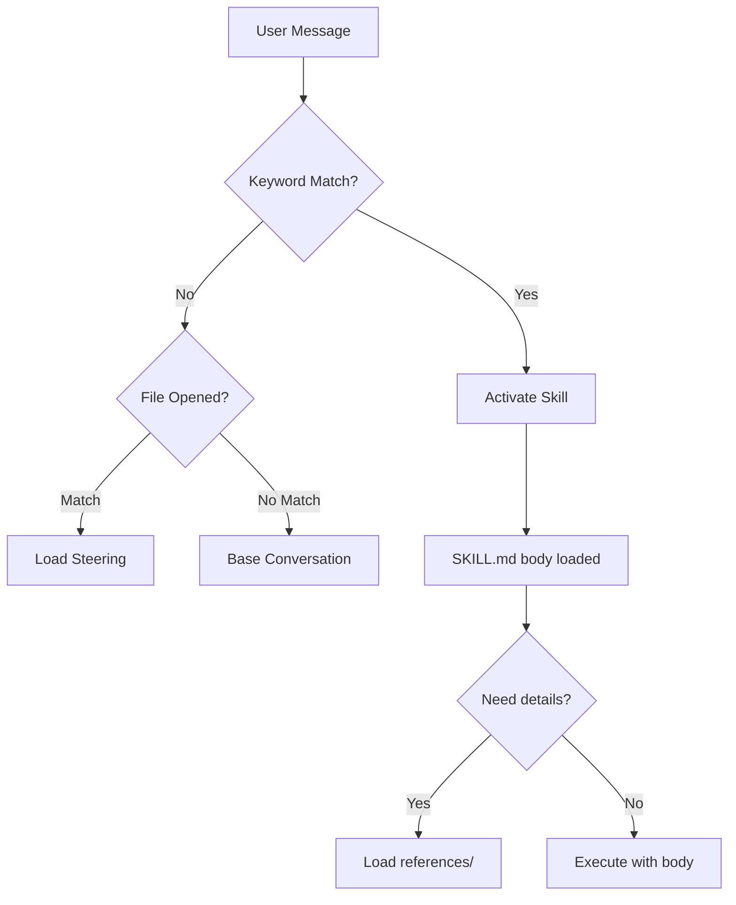

# kiro-skills

[](LICENSE)
[](#skills-by-category)
[](#steering)
[](#compatibility)

Personal Kiro user-scope configuration — skills, steering, and project context for full-stack cloud development.

## Architecture

```
~/.kiro/                              ← This repo (global user scope)
├── steering/                         ← Auto-loaded rules by file type
│   ├── always → every conversation
│   └── fileMatch → when matching files are opened
├── skills/                           ← On-demand domain expertise
│   ├── SKILL.md (frontmatter)        ← Discovery: ~100 tokens
│   ├── SKILL.md (body)               ← Activation: < 5000 tokens
│   └── references/                   ← Execution: loaded when needed
├── scripts/                          ← Automation (install, validate, index)
└── .kiro/hooks/                      ← Agent hooks (event-driven automation)
```



## Global vs Workspace

| Scope | Location | Priority | Use Case |
|-------|----------|----------|----------|
| **Global** (this repo) | `~/.kiro/` | Lower | Personal defaults across all projects |
| **Workspace** | `<project>/.kiro/` | Higher | Project-specific overrides |

- Workspace steering **overrides** global steering when names conflict
- Workspace skills **override** global skills with the same name
- Use global for personal style, tool preferences, domain knowledge
- Use workspace for team standards, project-specific rules

## Installation

### Fresh Install (recommended)

```bash
git clone https://github.com/shyswy/kiro-skills.git ~/.kiro
```

### Merge Into Existing Setup

```bash
git clone https://github.com/shyswy/kiro-skills.git /tmp/kiro-skills
bash /tmp/kiro-skills/scripts/install.sh --target=~/.kiro --backup
```

### Profile-Based Install

```bash
bash scripts/install.sh --profile=full      # Everything (default)
bash scripts/install.sh --profile=minimal   # Steering only
bash scripts/install.sh --profile=aws       # AWS skills only
bash scripts/install.sh --profile=infra     # K8s/Docker/Helm only
```

### Post-Install Setup

After cloning/installing, you need to set up the **private configuration** (not included in the repo):

```bash
# 1. Create your private environment config
cp ~/.kiro/steering/user-scope-config.example.md ~/.kiro/steering/_user-scope-config.md
# Edit with your actual environment (GitLab URL, Jira URL, team name, etc.)

# 2. Create MCP settings directory and config
mkdir -p ~/.kiro/settings
cat > ~/.kiro/settings/mcp.json << 'EOF'
{
  "mcpServers": {
    "example-server": {
      "command": "uvx",
      "args": ["your-mcp-server"],
      "env": {
        "API_TOKEN": "your-token-here"
      }
    }
  }
}
EOF

# 3. (Optional) Create private company-specific skills
mkdir -p ~/.kiro/skills/_my-company-skill
# Add SKILL.md with company-specific content
```

**What's private (gitignored, you must create locally):**

| Item | Location | Purpose |
|------|----------|---------|
| Environment config | `steering/_user-scope-config.md` | Your actual URLs, team name, MCP status |
| MCP settings | `settings/mcp.json` | API tokens for GitLab, Jira, Bitbucket, etc. |
| Company skills | `skills/_*/` | Company-specific domain knowledge |
| Work history | `history/` | Archived planning docs |

**What's public (included in repo):**

| Item | Location | Purpose |
|------|----------|---------|
| Config template | `steering/user-scope-config.example.md` | Template showing what to fill in |
| All skills without `_` prefix | `skills/*/` | Domain expertise |
| All steering without `_` prefix | `steering/*.md` | Coding rules |

## What's Inside

- **7 Steering files** — coding rules auto-applied by file type
- **43 Skills** — domain expertise loaded on-demand via [agentskills.io](https://agentskills.io) spec

<!-- SKILLS_START - Do not edit between these markers. Generated by update-skills-index.sh -->

### Steering

| File | Trigger | Scope |
|------|---------|-------|
| docker-rules.md | `Dockerfile*,docker-compose*` | Docker Rules |
| gitlab-ci-rules.md | `.gitlab-ci*` | GitLab CI Rules |
| k8s-helm-rules.md | `**/k8s/**/*.yaml,**/k8s/**/*.yml,**/helm/**/*.yaml,**/helm/**/*.yml,**/charts/**/*.yaml,**/charts/**/*.yml,**/manifests/**/*.yaml,**/manifests/**/*.yml,**/deploy/**/*.yaml,**/deploy/**/*.yml,**/templates/**/*.yaml` | Kubernetes / Helm Rules |
| personal-preferences.md | always | Personal Preferences |
| sql-rules.md | `*.sql,*migration*` | SQL Rules |
| typescript-rules.md | `*.ts,*.tsx,*.js,*.jsx` | TypeScript/JavaScript Rules |
| user-scope-config.example.md | always | User Scope Config (EXAMPLE) |

### Skills by Category

**AWS & Cloud**

- `api-gateway` — >
- `aws-agentic-ai` — AWS Bedrock AgentCore comprehensive expert for deploying and managing AI agents at scale. Use when working with any AgentCore service including Gateway, Runtime, Memory, Identity, Code Interpreter, Browser, Observability, Agent Registry, or Evaluations. Covers agent deployment, MCP tool integration, credential management, agent discovery, governance workflows, and automated quality assessment. Essential when user mentions AgentCore, agent runtime, agent registry, agent evaluation, MCP gateway, deploy agent, register MCP server, discover agents, evaluate agent quality, agent credentials, or wants to build, deploy, catalog, or monitor AI agents on AWS.
- `aws-cdk-development` — AWS Cloud Development Kit (CDK) expert for building cloud infrastructure with TypeScript/Python. Use when creating CDK stacks, defining CDK constructs, implementing infrastructure as code, or when the user mentions CDK, CloudFormation, IaC, cdk synth, cdk deploy, or wants to define AWS infrastructure programmatically. Covers CDK app structure, construct patterns, stack composition, and deployment workflows.
- `aws-cost-operations` — AWS cost optimization, monitoring, and operational excellence expert. Use when analyzing AWS bills, estimating costs, setting up CloudWatch alarms, querying logs, auditing CloudTrail activity, or assessing security posture. Essential when user mentions AWS costs, spending, billing, budget, pricing, CloudWatch, observability, monitoring, alerting, CloudTrail, audit, or wants to optimize AWS infrastructure costs and operational efficiency.
- `aws-lambda` — "Design, build, deploy, test, and debug serverless applications with AWS Lambda. Triggers on phrases like: Lambda function, event source, serverless application, API Gateway, EventBridge, Step Functions, serverless API, event-driven architecture, Lambda trigger. For deploying non-serverless apps to AWS, use deploy-on-aws plugin instead."
- `aws-lambda-durable-functions` — >
- `aws-mcp-setup` — Configure AWS MCP servers for documentation search and API access. Use when setting up AWS MCP, configuring AWS documentation tools, troubleshooting MCP connectivity, or when user mentions aws-mcp, awsdocs, uvx setup, or MCP server configuration. Covers both Full AWS MCP Server (with uvx + credentials) and lightweight Documentation MCP (no auth required).
- `aws-serverless-deployment` — "AWS SAM and AWS CDK deployment for serverless applications. Triggers on phrases like: use SAM, SAM template, SAM init, SAM deploy, CDK serverless, CDK Lambda construct, NodejsFunction, PythonFunction, SAM and CDK together, serverless CI/CD pipeline. For general app deployment with service selection, use deploy-on-aws plugin instead."
- `aws-serverless-eda` — AWS serverless and event-driven architecture expert based on Well-Architected Framework. Use when building serverless APIs, Lambda functions, REST APIs, microservices, or async workflows. Covers Lambda with TypeScript/Python, API Gateway (REST/HTTP), DynamoDB, Step Functions, EventBridge, SQS, SNS, and serverless patterns. Essential when user mentions serverless, Lambda, API Gateway, event-driven, async processing, queues, pub/sub, or wants to build scalable serverless applications with AWS best practices.
- `supabase-postgres` — Postgres performance optimization and best practices from Supabase. Use this skill when writing, reviewing, or optimizing Postgres queries, schema designs, or database configurations.
- `terraform-skill` — Use when writing, reviewing, or debugging Terraform/OpenTofu modules, tests, CI, scans, or state ops - diagnoses failure mode (identity churn, secrets, blast radius, CI drift, state corruption) with version-aware guards.

**Platform & Infra**

- `docker-container`
- `gitops-cicd`
- `helm-charts`
- `k8s-eks`
- `observability`

**Data & Messaging**

- `dynamodb`
- `elasticsearch-opensearch`
- `event-validation-patterns`
- `iot-messaging`
- `kafka-msk`
- `nodejs-kafka`
- `pg-raw-query-patterns`
- `rdb-optimization`

**Development**

- `api-design`
- `architecture`
- `coding-principles`
- `contract-testing`
- `git-gitlab`
- `java-spring`
- `kotlin-jpa-entity` — >
- `kotlin-spring`
- `network-protocols`
- `nodejs-typescript` — >
- `opensearch-node`
- `spring-data-jpa` — >
- `spring-layered-architecture` — >
- `testcontainers-node`

**Workflow & Management**

- `jira-workflow`
- `knowledge-publish`
- `project-context-manager`
- `quick-task-tracker`
- `repo-docs-sync`
- `scope-manager`
- `skill-creator` — Create new skills, modify and improve existing skills, and measure skill performance. Use when users want to create a skill from scratch, edit, or optimize an existing skill, run evals to test a skill, benchmark skill performance with variance analysis, or optimize a skill's description for better triggering accuracy.

<!-- SKILLS_END -->

## Compatibility

| Platform | Status | Notes |
|----------|--------|-------|
| Kiro IDE | ✅ Full | Primary target, all features |
| Kiro CLI | ✅ Full | Skills + steering work identically |
| Claude Code | ✅ Full | Export via `--target=claude-code` |
| Cursor | ✅ Full | Export via `--target=cursor` |
| GitHub Copilot | ✅ Full | Export via `--target=copilot` |
| Windsurf | ✅ Full | Export via `--target=windsurf` |
| Gemini CLI | ✅ Full | Export via `--target=gemini` |
| Other AI agents | ⚠️ Partial | SKILL.md readable, steering needs manual |

### Cross-Platform Export

Skills (SKILL.md) follow the [agentskills.io](https://agentskills.io) open standard — they work on 30+ platforms without modification.

Steering needs format conversion per platform. Use the export script:

```bash
# Export for a specific platform
bash scripts/export-for-platform.sh --target=agents-md --output=./my-project
bash scripts/export-for-platform.sh --target=cursor --output=./my-project
bash scripts/export-for-platform.sh --target=claude-code
bash scripts/export-for-platform.sh --target=copilot --output=./my-project

# Export for all platforms at once
bash scripts/export-for-platform.sh --target=all --output=./my-project --force

# Options
#   --target=PLATFORM   agents-md|claude-code|cursor|copilot|windsurf|gemini|all
#   --output=DIR        Output directory (default: platform-specific)
#   --force             Overwrite existing files
#   --skills-only       Export only skills
#   --steering-only     Export only steering conversion
```

| Platform | Skills Location | Steering Format |
|----------|----------------|-----------------|
| **AGENTS.md** (standard) | `./skills/` | `AGENTS.md` (single file, 20+ tools read natively) |
| Kiro | `~/.kiro/skills/` | `steering/*.md` (frontmatter) |
| Claude Code | `~/.claude/skills/` | `CLAUDE.md` (single file) |
| Cursor | `.cursor/skills/` | `.cursor/rules/*.mdc` (per-rule) |
| Copilot | `.github/skills/` | `.github/copilot-instructions.md` + `.github/instructions/*.instructions.md` |
| Windsurf | `.windsurf/skills/` | `.windsurfrules` (single file) |
| Gemini | `./skills/` | `GEMINI.md` (single file) |

## Private/Public Convention

```
_prefix = private (gitignored)

skills/_sprint-worklog-manager/   ← Company-specific, not published
steering/_user-scope-config.md    ← Contains personal URLs/tokens
settings/                         ← MCP configs with API tokens

No prefix = public (shared via this repo)
```

Fork this repo and add your own `_` prefixed files for company-specific content.

## Development

### Validate skills

```bash
bash scripts/validate-skills.sh
```

### Update README skills index

```bash
bash scripts/update-skills-index.sh
```

### Generate changelog

```bash
git-cliff -o CHANGELOG.md
```

## Requirements

| OS | Status | Notes |
|----|--------|-------|
| Linux | ✅ Full | Primary development platform |
| macOS | ✅ Full | Requires `bash 4+` (`brew install bash`) for `update-skills-index.sh` |
| Windows | ⚠️ Git Bash | Symlinks need Developer Mode or admin. Copy fallback automatic |

## Updating

Already installed? Pull the latest:

```bash
cd ~/.kiro && git pull origin main
```

If you installed via merge (copy/symlink into existing `~/.kiro`):

```bash
cd /path/to/kiro-skills-clone && git pull
bash scripts/install.sh --target=~/.kiro --force
```

Skills synced via symlink update automatically (no re-install needed).

## Troubleshooting

| Issue | Solution |
|-------|----------|
| `declare: -A: invalid option` (macOS) | Install bash 4+: `brew install bash` |
| Symlinks not working (Windows) | Enable Developer Mode, or scripts fall back to copy automatically |
| `command not found: realpath` (macOS) | Already handled — scripts use built-in fallback |
| Export overwrites my custom rules | Use `--force` only when intentional. Without it, existing files are skipped |
| Skills not activating in Kiro | Check SKILL.md has valid `name` + `description` in frontmatter |
| Steering not loading | Verify `inclusion:` field (always/fileMatch) and `fileMatchPattern:` |
| MCP server not connecting | Check `settings/mcp.json` tokens are valid, server command path exists |

## Adding Support for a New AI Agent

If a new AI coding tool appears and you want to add export support:

1. Research: What file does the tool read? (e.g., `TOOL.md`, `.tool/rules/`)
2. Add a function in `scripts/export-for-platform.sh`:
   ```bash
   export_newtool() {
     # Skills: symlink (same as all platforms)
     export_skills "$base/.newtool/skills"
     # Steering: convert to tool's format
     # ...
   }
   ```
3. Add to the dispatch `case` statement
4. Update README compatibility table
5. Run `bash scripts/validate-skills.sh` to verify nothing broke

## Contributing

See [CONTRIBUTING.md](CONTRIBUTING.md) for guidelines on adding skills and steering files.

## Architecture

See [ARCHITECTURE.md](ARCHITECTURE.md) for design decisions and rationale behind this structure.

## License

MIT — see [LICENSE](LICENSE)

## Attribution

See [ATTRIBUTION.md](ATTRIBUTION.md) for all referenced sources and licenses.
