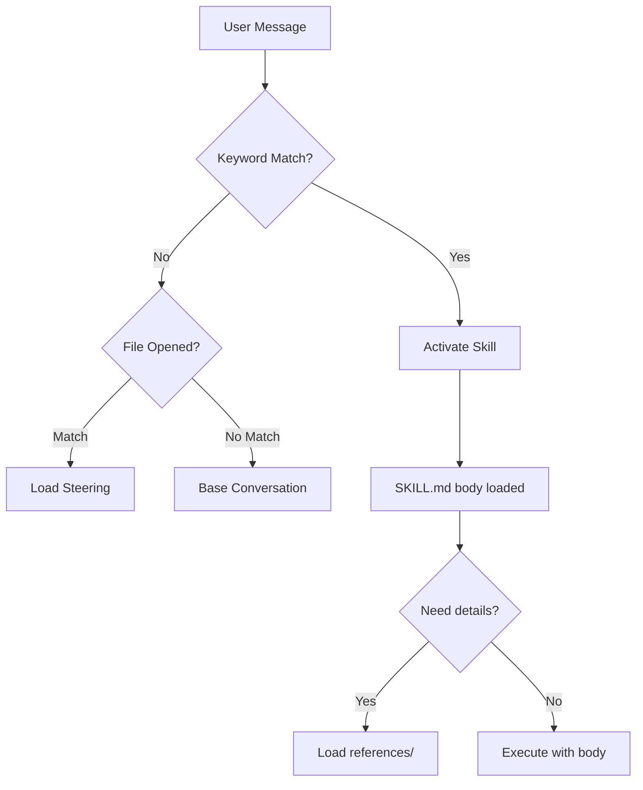

# kiro-skills

[](LICENSE)
[](#skills-by-category)
[](#steering)
[](#compatibility)

Personal Kiro user-scope configuration — skills, steering, and project context for full-stack cloud development.

## Architecture

```
~/.kiro/                              ← This repo (global user scope)
├── steering/                         ← Auto-loaded rules by file type
│   ├── always → every conversation
│   └── fileMatch → when matching files are opened
├── skills/                           ← On-demand domain expertise
│   ├── SKILL.md (frontmatter)        ← Discovery: ~100 tokens
│   ├── SKILL.md (body)               ← Activation: < 5000 tokens
│   └── references/                   ← Execution: loaded when needed
├── scripts/                          ← Automation (install, validate, index)
└── .kiro/hooks/                      ← Agent hooks (event-driven automation)
```



## Global vs Workspace

| Scope | Location | Priority | Use Case |
|-------|----------|----------|----------|
| **Global** (this repo) | `~/.kiro/` | Lower | Personal defaults across all projects |
| **Workspace** | `<project>/.kiro/` | Higher | Project-specific overrides |

- Workspace steering **overrides** global steering when names conflict
- Workspace skills **override** global skills with the same name
- Use global for personal style, tool preferences, domain knowledge
- Use workspace for team standards, project-specific rules

## Installation

### Fresh Install (recommended)

```bash
git clone https://github.com/shyswy/kiro-skills.git ~/.kiro
```

### Merge Into Existing Setup

```bash
git clone https://github.com/shyswy/kiro-skills.git /tmp/kiro-skills
bash /tmp/kiro-skills/scripts/install.sh --target=~/.kiro --backup
```

### Profile-Based Install

```bash
bash scripts/install.sh --profile=full      # Everything (default)
bash scripts/install.sh --profile=minimal   # Steering only
bash scripts/install.sh --profile=aws       # AWS skills only
bash scripts/install.sh --profile=infra     # K8s/Docker/Helm only
```

### Post-Install

```bash
# Create your private config from the template
cp ~/.kiro/steering/user-scope-config.example.md ~/.kiro/steering/_user-scope-config.md
# Edit with your environment (GitLab URL, Jira URL, team name, etc.)
```

## What's Inside

- **7 Steering files** — coding rules auto-applied by file type
- **29 Skills** — domain expertise loaded on-demand via [agentskills.io](https://agentskills.io) spec


### Steering

| File | Trigger | Scope |
|------|---------|-------|
| personal-preferences.md | always | Language & tone preferences |
| user-scope-config.example.md | always | Environment config template |
| typescript-rules.md | `*.ts,*.tsx,*.js,*.jsx` | TypeScript/JS coding rules |
| docker-rules.md | `Dockerfile*,docker-compose*` | Docker best practices |
| k8s-helm-rules.md | K8s/Helm YAML files | Kubernetes & Helm rules |
| sql-rules.md | `*.sql,*migration*` | SQL writing rules |
| gitlab-ci-rules.md | `.gitlab-ci*` | GitLab CI pipeline rules |

### Skills by Category

**AWS & Cloud**

- `api-gateway` — AWS API Gateway (REST, HTTP, WebSocket) patterns
- `aws-agentic-ai` — AWS Bedrock AgentCore for AI agent deployment
- `aws-cdk-development` — AWS CDK infrastructure as code
- `aws-cost-operations` — Cost optimization & CloudWatch monitoring
- `aws-lambda` — Serverless Lambda function design & deployment
- `aws-lambda-durable-functions` — Long-running stateful Lambda workflows
- `aws-mcp-setup` — AWS MCP server configuration
- `aws-serverless-deployment` — SAM/CDK serverless deployment
- `aws-serverless-eda` — Serverless event-driven architecture
- `supabase-postgres` — PostgreSQL best practices (Supabase)

**Platform & Infra**

- `docker-container` — Docker build, multi-stage, ECR integration
- `gitops-cicd` — GitLab CI/CD, ArgoCD GitOps deployment
- `helm-charts` — Helm chart authoring & management
- `k8s-eks` — Kubernetes/EKS orchestration, IRSA, Karpenter
- `observability` — Prometheus, Grafana, ELK monitoring stack
- `terraform-skill` — Terraform/OpenTofu IaC patterns

**Data & Messaging**

- `dynamodb` — DynamoDB key design, GSI/LSI, single-table
- `elasticsearch-opensearch` — Elasticsearch/OpenSearch indexing & queries
- `iot-messaging` — IoT Core, MQTT message pipeline, normalization
- `kafka-msk` — Kafka/MSK messaging, Streams, exactly-once
- `rdb-optimization` — PostgreSQL/MySQL query optimization, RDS Proxy

**Development**

- `api-design` — REST/GraphQL API design, OpenAPI, versioning
- `architecture` — MSA, Event-Driven, DDD, Egress-Worker patterns
- `git-gitlab` — GitLab version control, MR strategy, branching
- `typescript-node` — TypeScript/Node.js patterns, NestJS, Express

**Workflow & Management**

- `jira-workflow` — Jira issue management, commit→issue linking
- `knowledge-publish` — Publish skills to Confluence/GitHub/Notion
- `project-context-manager` — Project context documentation
- `scope-manager` — User scope environment management
- `skill-creator` — Create, edit, and optimize skills

## Compatibility

| Platform | Status | Notes |
|----------|--------|-------|
| Kiro IDE | ✅ Full | Primary target, all features |
| Kiro CLI | ✅ Full | Skills + steering work identically |
| Claude Code | ✅ Full | Export via `--target=claude-code` |
| Cursor | ✅ Full | Export via `--target=cursor` |
| GitHub Copilot | ✅ Full | Export via `--target=copilot` |
| Windsurf | ✅ Full | Export via `--target=windsurf` |
| Gemini CLI | ✅ Full | Export via `--target=gemini` |
| Other AI agents | ⚠️ Partial | SKILL.md readable, steering needs manual |

### Cross-Platform Export

Skills (SKILL.md) follow the [agentskills.io](https://agentskills.io) open standard — they work on 30+ platforms without modification.

Steering needs format conversion per platform. Use the export script:

```bash
# Export for a specific platform
bash scripts/export-for-platform.sh --target=agents-md --output=./my-project
bash scripts/export-for-platform.sh --target=cursor --output=./my-project
bash scripts/export-for-platform.sh --target=claude-code
bash scripts/export-for-platform.sh --target=copilot --output=./my-project

# Export for all platforms at once
bash scripts/export-for-platform.sh --target=all --output=./my-project --force

# Options
#   --target=PLATFORM   agents-md|claude-code|cursor|copilot|windsurf|gemini|all
#   --output=DIR        Output directory (default: platform-specific)
#   --force             Overwrite existing files
#   --skills-only       Export only skills
#   --steering-only     Export only steering conversion
```

| Platform | Skills Location | Steering Format |
|----------|----------------|-----------------|
| **AGENTS.md** (standard) | `./skills/` | `AGENTS.md` (single file, 20+ tools read natively) |
| Kiro | `~/.kiro/skills/` | `steering/*.md` (frontmatter) |
| Claude Code | `~/.claude/skills/` | `CLAUDE.md` (single file) |
| Cursor | `.cursor/skills/` | `.cursor/rules/*.mdc` (per-rule) |
| Copilot | `.github/skills/` | `.github/copilot-instructions.md` + `.github/instructions/*.instructions.md` |
| Windsurf | `.windsurf/skills/` | `.windsurfrules` (single file) |
| Gemini | `./skills/` | `GEMINI.md` (single file) |

## Private/Public Convention

```
_prefix = private (gitignored)

skills/_sprint-worklog-manager/   ← Company-specific, not published
steering/_user-scope-config.md    ← Contains personal URLs/tokens

No prefix = public (shared via this repo)
```

Fork this repo and add your own `_` prefixed files for company-specific content.

## Development

### Validate skills

```bash
bash scripts/validate-skills.sh
```

### Update README index

```bash
bash scripts/update-skills-index.sh
```

### Generate changelog

```bash
git-cliff -o CHANGELOG.md
```

## Contributing

See [CONTRIBUTING.md](CONTRIBUTING.md) for guidelines on adding skills and steering files.

## License

MIT — see [LICENSE](LICENSE)

## Attribution

See [ATTRIBUTION.md](ATTRIBUTION.md) for all referenced sources and licenses.
